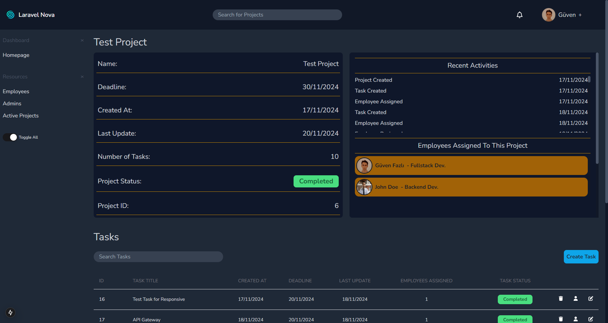

# Laravel Nova

Laravel Nova is a robust CMS (Content Management System) designed to streamline project and task management for teams. With a clear focus on real-time updates, role-based functionalities, and clean code practices, this application provides a seamless experience for administrators and employees alike.

Built with Next.js, Express.js, and powered by a MySQL database using Sequelize, Laravel Nova offers a feature-rich platform with optimized performance and scalability. The application is also fully responsive, ensuring that it provides a smooth and user-friendly experience on devices of all sizes—whether you’re on a mobile phone, tablet, or desktop.

## Features 
#Admin Features 
- **Employee Management**: Admins can create, edit, and manage employee profiles.
- **Project and Task Management**: As an Admin, you can;
- Create projects and tasks under those projects.
- Assign employees to specific projects.
- Change the status of projects and tasks.
- **Real-Time Updates**: Every change is instantly synchronized across the platform using WebSocket, eliminating the need for manual page reloads.

#Employee Features 
- **Task Management**: Employees can view their assigned tasks and update task statuses..
- **Profile Customization**: Edit profiles with ease, including custom stats like;
- Total projects assigned.
- Completed projects for the week.
- Productivity and Activity Points.
- **Search and Filters**: Quickly find relevant information using search bars and table filters.
- **Notifications**: Get instant notifications for:
- Task assignments.
- Project completions.
- Productivity and Activity Points updates.

## Key Systems 
**Productivity Points System** 
Employees earn +3 Productivity Points for every 5 projects they successfully complete, encouraging consistent performance.

**Activity Points System** 
Employees earn +15 Activity Points for every 30 minutes of active login. This system runs seamlessly in the background, powered by Node-Cron.

## Technologies 
- **Frontend**: Next.js, Tailwind CSS
- **Backend**: Express.js, Express Validator, Socket.IO
- **Database**: MySQL with Sequelize ORM.
- **Authentication**: JWT (JSON Web Tokens).
- **Real-Time Communication**: WebSocket.
- **Data Visualization**: Recharts.
- **Activity Points Tracking**: Node-Cron.

## Optimized Rendering 
- **Server-Side Rendering (SSR)**: Utilized for static pages, like user profiles, to improve performance and SEO.
- **Client-Side Rendering (CSR)**: Implemented for dynamic and frequently updated pages.

## Clean Code Practises 
- **Reusable Components**: Modular and reusable micro-components ensure maintainable and scalable code.
- **Secure Cookies**: HTTP-only and secure cookies enhance security.
- **Validation and Protection**:
- Input validation using Express Validator for all API requests.
- Route protection for secure access to sensitive API endpoints.

  
 
App preview
  
<h3>Login / Sign In Page</h3>

<h3>Homepage</h3>

<h3>Employee List</h3>

<h3>Project List</h3>

<h3>Project Details</h3>

<h3>Employee Profile</h3>

**HERE WILL BE THE RECHARTS OF THE WEEKLY COMPLETED PROJECTS**
<h3>Notifications</h3>

  
